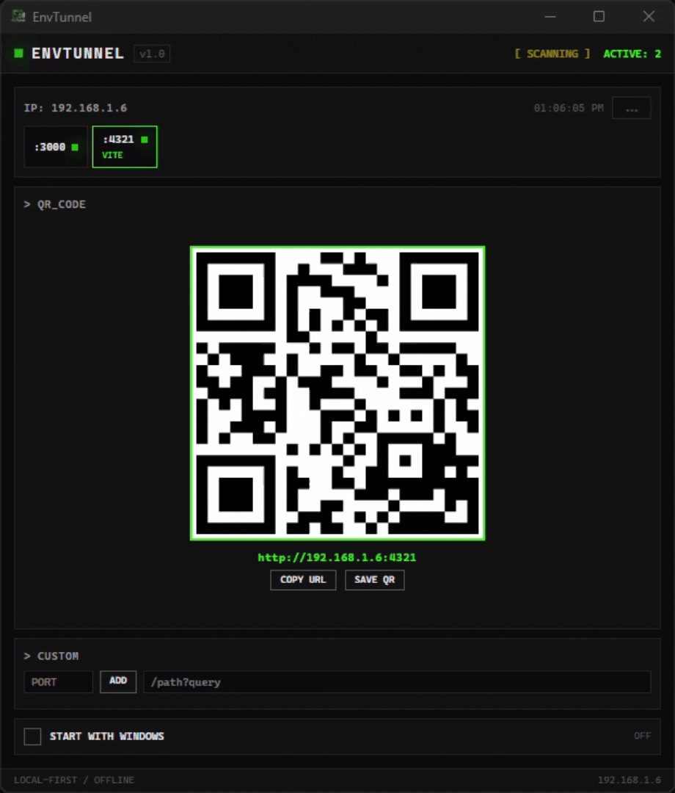

# EnvTunnel

> A free, local-first desktop tool that scans for active dev servers and generates instant QR codes - so you can open your localhost on any device in your network with one scan.



---

## 🔥 What is it?

**EnvTunnel** is a Windows desktop application built with [Tauri](https://tauri.app/) + React + TypeScript. It sits in your system tray, silently monitors popular development ports, and the moment it detects an active server — it generates a large QR code using your real local network IP (e.g. `192.168.1.15`).

No cloud. No accounts. No internet required. 100% offline.

## 🎯 Who is it for?

- **Frontend developers** who test websites on real phones/tablets
- **Full-stack developers** running local APIs and web apps
- **Designers** who want to preview work on mobile devices
- **Anyone** who is tired of typing `192.168.x.x:3000` on a phone keyboard

## ✨ Features

| Feature | Description |
|---------|-------------|
| 🔍 **Auto-scan** | Checks 16+ popular dev ports every 3 seconds |
| 📱 **QR Codes** | Big, scannable QR generated instantly for any active port |
| 🧠 **Framework Detection** | Recognizes Vite, Next.js, Astro, Angular, Nuxt, Gatsby, Django, Flask, Laravel, Rails, Express |
| 🔔 **Toast Notifications** | Get notified when a new dev server comes online |
| ⚡ **Live Reload Indicator** | Orange pulse shows which port just became active |
| ➕ **Custom Ports** | Add any port manually (e.g. `6969`) |
| 🔗 **Custom Paths** | Append `/admin`, `?debug=true` or any path to the QR URL |
| 📋 **Copy URL** | One-click copy of the full address to clipboard |
| 💾 **Save QR** | Export QR code as PNG image |
| 🖥️ **System Tray** | Minimizes to tray — click to restore, right-click to quit |
| 🚀 **Autostart** | Optional launch with Windows |

## 📡 Supported Ports (Default)

EnvTunnel scans these ports out of the box:

| Port | Common Use |
|------|-----------|
| `3000` | React, Next.js, Express |
| `4321` | Astro |
| `5173` | Vite |
| `8080` | Vue, general dev |
| `4200` | Angular |
| `5000` | Flask, ASP.NET |
| `8000` | Django, general dev |
| `9000` | Gatsby |
| `3333` | Nuxt 2 |
| `3030` | Parcel |
| `5500` | Live Server (VS Code) |
| `4000` | SvelteKit, Rails |
| `6000` | Create React App |
| `7000` | Vercel dev |
| `5001` | ASP.NET alternate |
| `8001` | Django alternate |

You can also **add any custom port** via the in-app input.

## 📸 Screenshots

*Placeholder — replace with your own screenshots after generating the logo.*

```
[Main Window]      [QR Generated]      [System Tray]
```

## 🚀 Installation

### For Users (Just want the .exe)

1. Download `EnvTunnel_0.1.0_x64-setup.exe` from [Releases](../../releases)
2. Run the installer
3. Launch EnvTunnel from Start Menu or Desktop

### For Developers (Build from source)

**Prerequisites:**

- [Node.js](https://nodejs.org/) 18+
- [Rust](https://rustup.rs/) 1.77+
- Windows with Visual Studio Build Tools (for `legacy_stdio_definitions.lib`)

**Build steps:**

```bash
# Clone
git clone https://github.com/YOUR_USERNAME/envtunnel.git
cd envtunnel

# Install dependencies
npm install

# Build frontend + Tauri (production)
npm run tauri build

# The .exe will be at:
# src-tauri/target/release/app.exe
```

> **Note for Windows builders:** If you get `LNK1181: cannot open input file legacy_stdio_definitions.lib`, add this to your `LIB` environment variable:
>
> ```
> C:\Program Files\Microsoft Visual Studio\2022\Community\VC\Tools\MSVC\14.44.35207\lib\onecore\x64
> ```

## 🎮 How to Use

### 1. Start your dev server

Run your project as usual, e.g.:

```bash
npm run dev          # Vite, Astro, Next.js, etc.
```

**Important:** Some frameworks (like Astro) only bind to `localhost` by default. To access from your phone, add `--host`:

```bash
npm run dev -- --host
```

### 2. EnvTunnel detects it automatically

The app scans every 3 seconds. When your port turns **ON** (green), it appears in the list.

### 3. Click the port

Select the active port. The QR code updates instantly.

### 4. Scan with your phone

Open your camera app and scan the QR code. Your phone browser opens the local URL directly.

### 5. Pro tips

- **Custom Path**: Type `/admin` in the Custom section to generate `http://192.168.1.15:3000/admin`
- **Save QR**: Click "SAVE QR" to download the code as a PNG
- **Tray Mode**: Clicking **X** minimizes to system tray. Right-click the tray icon to fully quit.

## 🛠️ Tech Stack

| Layer | Technology |
|-------|-----------|
| **Framework** | [Tauri](https://tauri.app/) v2 |
| **Frontend** | React 19 + TypeScript |
| **Bundler** | Vite |
| **Styling** | Tailwind CSS v4 (new `@theme` syntax) |
| **QR Generation** | [qrcode.react](https://www.npmjs.com/package/qrcode.react) |
| **Autostart** | [tauri-plugin-autostart](https://github.com/tauri-apps/tauri-plugin-autostart) |
| **HTTP Scanning** | [reqwest](https://github.com/seanmonstar/reqwest) (Rust) |
| **Design Style** | Digital Brutalism |

## 🏗️ Architecture (Simple Explanation)

EnvTunnel is a **local-first** desktop app. It works completely offline:

1. **Rust Backend** (`src-tauri/src/lib.rs`)
   - Gets your real local Wi-Fi IP address
   - Scans ports by attempting TCP connections to `127.0.0.1`
   - Performs HTTP GET requests to detect frameworks from HTML

2. **React Frontend** (`src/App.tsx`)
   - Displays active ports as compact buttons
   - Generates QR codes using your network IP (not localhost!)
   - Handles copy/save/autostart UI interactions

3. **System Tray** (Rust)
   - Keeps the app running in the background
   - Prevents accidental close (hides instead)

## 🤝 Contributing

Contributions are welcome! This is an open-source project meant to help developers.

1. Fork the repository
2. Create a feature branch: `git checkout -b feature/my-feature`
3. Commit your changes: `git commit -am 'Add new feature'`
4. Push to the branch: `git push origin feature/my-feature`
5. Open a Pull Request

### Ideas for contributions

- Add more framework detection patterns
- Support for macOS / Linux builds
- Dark/Light theme toggle
- ngrok / Cloudflare Tunnel integration
- Network device scanner
- QR code style customization

## 📄 License

MIT License — feel free to use, modify, and distribute.

---

<p align="center">
  Built with 💚 and neon green pixels.<br>
  <strong>EnvTunnel</strong> — stop typing IP addresses on your phone.
</p>
