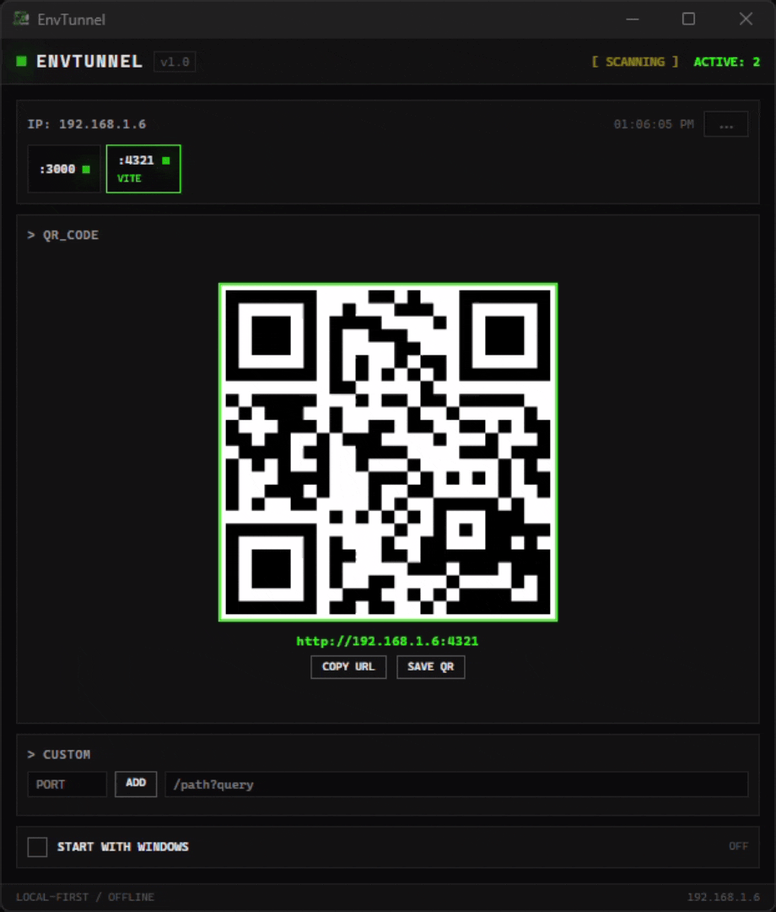

# EnvTunnel

> A free tray app for **Windows, macOS, and Linux** that detects running development servers and generates QR codes for testing them on phones and tablets on the same local network.



---

## 🔥 What is it?

**EnvTunnel** is a desktop application built with [Tauri](https://tauri.app/) + React + TypeScript. Start your project in your usual terminal or IDE. EnvTunnel monitors common development ports in the background and generates a QR code with your local network address (e.g. `http://192.168.1.15:5173`) when the server accepts connections on that address.

Windows, macOS, and Linux. No cloud. No accounts. No internet required. 100% offline.

### How it fits your workflow

EnvTunnel focuses on one task: getting an already-running development server onto your phone without typing its IP address. Keep your existing editor, terminal, and project setup; there is no need to import your project or manage it through a separate app launcher.

Despite the name, EnvTunnel currently provides **port discovery and LAN QR codes**, not a network tunnel or reverse proxy. It does not create public internet links, forward traffic, or change your server's listening address or firewall rules. Public tunnel integrations are possible future contributions.

Your computer and phone need to be on the same local network, with connections between them allowed. The server must listen on a network interface, not only `localhost`. EnvTunnel checks the computer's LAN address from that computer; this cannot guarantee that a phone can reach it through a firewall or Wi-Fi client isolation.

## 🎯 Who is it for?

- **Frontend developers** who test websites on real phones/tablets
- **Full-stack developers** running local APIs and web apps
- **Designers** who want to preview work on mobile devices
- **Anyone** who is tired of typing `192.168.x.x:3000` on a phone keyboard

## ✨ Features

| Feature | Description |
|---------|-------------|
| 🔍 **Auto-scan** | Checks 16 default dev ports plus custom ports; waits 3 seconds between completed automatic scans |
| 📱 **QR Codes** | Scannable QR for active servers that accept connections on the computer's LAN address |
| 📡 **Local-only detection** | Shows a warning when a server is active but the LAN connection check fails |
| 🧠 **Framework Detection** | Recognizes Vite, Next.js, Astro, Angular, Nuxt, Gatsby, Django, Flask, Laravel, Rails, Express |
| 🔔 **Notifications** | In-app toast plus a native OS notification when a new server comes online (works from the tray) |
| ⚡ **Live Reload Indicator** | Orange pulse shows which port just became active |
| 🌐 **Interface picker** | Click the IP to switch Wi-Fi / Ethernet / VPN if the QR used the wrong adapter |
| ➕ **Custom Ports** | Add any port manually (e.g. `6969`) |
| 🔗 **Custom Paths** | Append `/admin`, `?debug=true` or any path to the QR URL |
| 📋 **Copy URL** | One-click copy of the full address to clipboard |
| 💾 **Save QR** | Export QR code as PNG image |
| 🌍 **Open in browser** | Open the same URL on this PC to sanity-check it |
| 🖥️ **System Tray** | Minimizes to tray. Click to restore, right-click to quit |
| 🚀 **Autostart** | Optional launch on login |

## 📡 Supported Ports (Default)

EnvTunnel scans these ports out of the box:

| Port | Common Use |
|------|-----------|
| `3000` | React, Next.js, Express |
| `4321` | Astro |
| `5173` | Vite |
| `8080` | Vue, general dev |
| `4200` | Angular |
| `5000` | Flask, ASP.NET |
| `8000` | Django, general dev |
| `9000` | Gatsby |
| `3333` | Nuxt 2 |
| `3030` | Parcel |
| `5500` | Live Server (VS Code) |
| `4000` | SvelteKit, Rails |
| `6000` | Create React App |
| `7000` | Vercel dev |
| `5001` | ASP.NET alternate |
| `8001` | Django alternate |

You can also **add any custom port** via the in-app input.


---

<a id="installation"></a>
## 🚀 Installation

### For Users

1. Download the installer for your OS from [Releases](../../releases)
2. Run it (Windows setup/MSI, macOS `.dmg`, Linux AppImage/`.deb`)
3. Launch EnvTunnel from the Start Menu, Applications, or your desktop

### For Developers (Build from source)

**Prerequisites:**

- [Node.js](https://nodejs.org/) 18+
- [Rust](https://rustup.rs/) 1.77+
- Windows: Visual Studio Build Tools (for `legacy_stdio_definitions.lib`)
- macOS: Xcode Command Line Tools
- Linux: WebKitGTK 4.1 and related Tauri system packages

**Build steps:**

```bash
# Clone
git clone https://github.com/hsr88/envtunnel.git
cd envtunnel

# Install dependencies
npm install

# Build frontend + Tauri (production)
npm run tauri build

# The binary will be at:
# src-tauri/target/release/envtunnel.exe          (Windows)
# src-tauri/target/release/envtunnel              (macOS / Linux)
# plus installers under src-tauri/target/release/bundle/
```

> **Note for Windows builders:** If you get `LNK1181: cannot open input file legacy_stdio_definitions.lib`, add this to your `LIB` environment variable:
>
> ```
> C:\Program Files\Microsoft Visual Studio\2022\Community\VC\Tools\MSVC\14.44.35207\lib\onecore\x64
> ```

## 🎮 How to Use

### 1. Start your dev server

Run your project as usual, e.g.:

```bash
npm run dev          # Vite, Astro, Next.js, etc.
```

**Important:** Your server must accept connections from the local network. For Vite or Astro, you can pass `--host` through your development script:

```bash
npm run dev -- --host
```

Other servers may use a different option; use your framework's documented host setting. If EnvTunnel shows **LOCAL ONLY**, check that setting and restart the server as needed. The selected port's status refreshes after the next scan, so you do not need to select it again.

### 2. EnvTunnel detects it automatically

Active ports appear in the list. Automatic scans wait 3 seconds after the previous scan finishes; you can also click **SCAN** to refresh manually.

### 3. Click the port

Select the active port. The QR code updates instantly.

### 4. Scan with your phone

Open your camera app and scan the QR code. Your phone browser opens the local URL directly.

If the page does not open, confirm that both devices are on the same local network and that the server's port is allowed through your firewall. Guest Wi-Fi or client isolation can prevent devices from reaching each other even when they use the same Wi-Fi name.

### 5. Pro tips

- **Custom Path**: Type `/admin` in the Custom section to generate `http://192.168.1.15:3000/admin`
- **Save QR**: Click "SAVE QR" to download the code as a PNG
- **Open**: Click "OPEN" to load the same URL in your desktop browser
- **Pick IP**: Click the IP if the QR used a VPN/WSL adapter instead of Wi-Fi
- **Tray Mode**: Clicking **X** minimizes to system tray. Right-click the tray icon to fully quit.

## 🛠️ Tech Stack

| Layer | Technology |
|-------|-----------|
| **Framework** | [Tauri](https://tauri.app/) v2 |
| **Frontend** | React 19 + TypeScript |
| **Bundler** | Vite |
| **Styling** | Tailwind CSS v4 (new `@theme` syntax) |
| **QR Generation** | [qrcode.react](https://www.npmjs.com/package/qrcode.react) |
| **Autostart** | [tauri-plugin-autostart](https://github.com/tauri-apps/tauri-plugin-autostart) |
| **HTTP Scanning** | [reqwest](https://github.com/seanmonstar/reqwest) (Rust) |
| **Design Style** | Digital Brutalism |

## 🏗️ Architecture (Simple Explanation)

EnvTunnel is a **local-first** desktop app. It works completely offline:

1. **Rust Backend** (`src-tauri/src/lib.rs`)
   - Lists network interfaces and recommends a LAN address; you can choose another interface
   - Scans ports using TCP connections to IPv4/IPv6 loopback and the selected LAN address
   - Performs HTTP GET requests to detect frameworks from HTML

2. **React Frontend** (`src/App.tsx`)
   - Displays active ports as compact buttons
   - Generates QR codes using your network IP (not localhost!)
   - Handles copy/save/autostart UI interactions

3. **System Tray** (Rust)
   - Keeps the app running in the background
   - Prevents accidental close (hides instead)

## 🗺️ Roadmap

Planned work lives in [ROADMAP.md](ROADMAP.md): process names, extra default ports, pin a port, HTTPS QR, `--host` copy, path presets, optional tunnels, global hotkey.

## 🤝 Contributing

Contributions are welcome! This is an open-source project meant to help developers.

1. Fork the repository
2. Create a feature branch: `git checkout -b feature/my-feature`
3. Commit your changes: `git commit -am 'Add new feature'`
4. Push to the branch: `git push origin feature/my-feature`
5. Open a Pull Request

### Ideas for contributions

See [ROADMAP.md](ROADMAP.md). Small, focused PRs are preferred.

## 📄 License

MIT License. Feel free to use, modify, and distribute.

---

<p align="center">
  Built with 💚 and neon green pixels.<br>
  <strong>EnvTunnel</strong>. Stop typing IP addresses on your phone.
</p>
